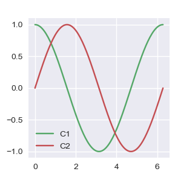

```python
import numpy as np
import matplotlib.pyplot as plt
import matplotlib as mpl

th = np.linspace(0, 2*np.pi, 128)


def demo(sty):
    mpl.style.use(sty)
    fig, ax = plt.subplots(figsize=(3, 3))

    ax.set_title('style: {!r}'.format(sty), color='C1')

    ax.plot(th, np.cos(th), 'C1', label='C1')
    ax.plot(th, np.sin(th), 'C2', label='C2')
    ax.legend()

demo('default')
demo('seaborn')
```

    Error in callback <function install_repl_displayhook.<locals>.post_execute at 0x000001981CBBB9D8> (for post_execute):
    


    ---------------------------------------------------------------------------

    KeyError                                  Traceback (most recent call last)

    ~\.conda\envs\learn-env\lib\site-packages\matplotlib\colors.py in to_rgba(c, alpha)
        173     try:
    --> 174         rgba = _colors_full_map.cache[c, alpha]
        175     except (KeyError, TypeError):  # Not in cache, or unhashable.
    

    KeyError: ('C10', None)

    
    During handling of the above exception, another exception occurred:
    

    ValueError                                Traceback (most recent call last)

    ~\.conda\envs\learn-env\lib\site-packages\matplotlib\pyplot.py in post_execute()
        107             def post_execute():
        108                 if matplotlib.is_interactive():
    --> 109                     draw_all()
        110 
        111             # IPython >= 2
    

    ~\.conda\envs\learn-env\lib\site-packages\matplotlib\_pylab_helpers.py in draw_all(cls, force)
        130         for f_mgr in cls.get_all_fig_managers():
        131             if force or f_mgr.canvas.figure.stale:
    --> 132                 f_mgr.canvas.draw_idle()
        133 
        134 atexit.register(Gcf.destroy_all)
    

    ~\.conda\envs\learn-env\lib\site-packages\matplotlib\backend_bases.py in draw_idle(self, *args, **kwargs)
       1897         if not self._is_idle_drawing:
       1898             with self._idle_draw_cntx():
    -> 1899                 self.draw(*args, **kwargs)
       1900 
       1901     def draw_cursor(self, event):
    

    ~\.conda\envs\learn-env\lib\site-packages\matplotlib\backends\backend_agg.py in draw(self)
        400         toolbar = self.toolbar
        401         try:
    --> 402             self.figure.draw(self.renderer)
        403             # A GUI class may be need to update a window using this draw, so
        404             # don't forget to call the superclass.
    

    ~\.conda\envs\learn-env\lib\site-packages\matplotlib\artist.py in draw_wrapper(artist, renderer, *args, **kwargs)
         48                 renderer.start_filter()
         49 
    ---> 50             return draw(artist, renderer, *args, **kwargs)
         51         finally:
         52             if artist.get_agg_filter() is not None:
    

    ~\.conda\envs\learn-env\lib\site-packages\matplotlib\figure.py in draw(self, renderer)
       1647 
       1648             mimage._draw_list_compositing_images(
    -> 1649                 renderer, self, artists, self.suppressComposite)
       1650 
       1651             renderer.close_group('figure')
    

    ~\.conda\envs\learn-env\lib\site-packages\matplotlib\image.py in _draw_list_compositing_images(renderer, parent, artists, suppress_composite)
        136     if not_composite or not has_images:
        137         for a in artists:
    --> 138             a.draw(renderer)
        139     else:
        140         # Composite any adjacent images together
    

    ~\.conda\envs\learn-env\lib\site-packages\matplotlib\artist.py in draw_wrapper(artist, renderer, *args, **kwargs)
         48                 renderer.start_filter()
         49 
    ---> 50             return draw(artist, renderer, *args, **kwargs)
         51         finally:
         52             if artist.get_agg_filter() is not None:
    

    ~\.conda\envs\learn-env\lib\site-packages\matplotlib\axes\_base.py in draw(self, renderer, inframe)
       2626             renderer.stop_rasterizing()
       2627 
    -> 2628         mimage._draw_list_compositing_images(renderer, self, artists)
       2629 
       2630         renderer.close_group('axes')
    

    ~\.conda\envs\learn-env\lib\site-packages\matplotlib\image.py in _draw_list_compositing_images(renderer, parent, artists, suppress_composite)
        136     if not_composite or not has_images:
        137         for a in artists:
    --> 138             a.draw(renderer)
        139     else:
        140         # Composite any adjacent images together
    

    ~\.conda\envs\learn-env\lib\site-packages\matplotlib\artist.py in draw_wrapper(artist, renderer, *args, **kwargs)
         48                 renderer.start_filter()
         49 
    ---> 50             return draw(artist, renderer, *args, **kwargs)
         51         finally:
         52             if artist.get_agg_filter() is not None:
    

    ~\.conda\envs\learn-env\lib\site-packages\matplotlib\text.py in draw(self, renderer)
        725 
        726             gc = renderer.new_gc()
    --> 727             gc.set_foreground(textobj.get_color())
        728             gc.set_alpha(textobj.get_alpha())
        729             gc.set_url(textobj._url)
    

    ~\.conda\envs\learn-env\lib\site-packages\matplotlib\backend_bases.py in set_foreground(self, fg, isRGBA)
        966             self._rgb = fg
        967         else:
    --> 968             self._rgb = colors.to_rgba(fg)
        969 
        970     def set_joinstyle(self, js):
    

    ~\.conda\envs\learn-env\lib\site-packages\matplotlib\colors.py in to_rgba(c, alpha)
        174         rgba = _colors_full_map.cache[c, alpha]
        175     except (KeyError, TypeError):  # Not in cache, or unhashable.
    --> 176         rgba = _to_rgba_no_colorcycle(c, alpha)
        177         try:
        178             _colors_full_map.cache[c, alpha] = rgba
    

    ~\.conda\envs\learn-env\lib\site-packages\matplotlib\colors.py in _to_rgba_no_colorcycle(c, alpha)
        218         except ValueError:
        219             pass
    --> 220         raise ValueError("Invalid RGBA argument: {!r}".format(orig_c))
        221     # tuple color.
        222     c = np.array(c)
    

    ValueError: Invalid RGBA argument: 'C10'


    ---------------------------------------------------------------------------

    KeyError                                  Traceback (most recent call last)

    ~\.conda\envs\learn-env\lib\site-packages\matplotlib\colors.py in to_rgba(c, alpha)
        173     try:
    --> 174         rgba = _colors_full_map.cache[c, alpha]
        175     except (KeyError, TypeError):  # Not in cache, or unhashable.
    

    KeyError: ('C10', None)

    
    During handling of the above exception, another exception occurred:
    

    ValueError                                Traceback (most recent call last)

    ~\.conda\envs\learn-env\lib\site-packages\IPython\core\formatters.py in __call__(self, obj)
        339                 pass
        340             else:
    --> 341                 return printer(obj)
        342             # Finally look for special method names
        343             method = get_real_method(obj, self.print_method)
    

    ~\.conda\envs\learn-env\lib\site-packages\IPython\core\pylabtools.py in <lambda>(fig)
        239 
        240     if 'png' in formats:
    --> 241         png_formatter.for_type(Figure, lambda fig: print_figure(fig, 'png', **kwargs))
        242     if 'retina' in formats or 'png2x' in formats:
        243         png_formatter.for_type(Figure, lambda fig: retina_figure(fig, **kwargs))
    

    ~\.conda\envs\learn-env\lib\site-packages\IPython\core\pylabtools.py in print_figure(fig, fmt, bbox_inches, **kwargs)
        123 
        124     bytes_io = BytesIO()
    --> 125     fig.canvas.print_figure(bytes_io, **kw)
        126     data = bytes_io.getvalue()
        127     if fmt == 'svg':
    

    ~\.conda\envs\learn-env\lib\site-packages\matplotlib\backend_bases.py in print_figure(self, filename, dpi, facecolor, edgecolor, orientation, format, bbox_inches, **kwargs)
       2047                         orientation=orientation,
       2048                         dryrun=True,
    -> 2049                         **kwargs)
       2050                     renderer = self.figure._cachedRenderer
       2051                     bbox_artists = kwargs.pop("bbox_extra_artists", None)
    

    ~\.conda\envs\learn-env\lib\site-packages\matplotlib\backends\backend_agg.py in print_png(self, filename_or_obj, *args, **kwargs)
        508 
        509         """
    --> 510         FigureCanvasAgg.draw(self)
        511         renderer = self.get_renderer()
        512 
    

    ~\.conda\envs\learn-env\lib\site-packages\matplotlib\backends\backend_agg.py in draw(self)
        400         toolbar = self.toolbar
        401         try:
    --> 402             self.figure.draw(self.renderer)
        403             # A GUI class may be need to update a window using this draw, so
        404             # don't forget to call the superclass.
    

    ~\.conda\envs\learn-env\lib\site-packages\matplotlib\artist.py in draw_wrapper(artist, renderer, *args, **kwargs)
         48                 renderer.start_filter()
         49 
    ---> 50             return draw(artist, renderer, *args, **kwargs)
         51         finally:
         52             if artist.get_agg_filter() is not None:
    

    ~\.conda\envs\learn-env\lib\site-packages\matplotlib\figure.py in draw(self, renderer)
       1647 
       1648             mimage._draw_list_compositing_images(
    -> 1649                 renderer, self, artists, self.suppressComposite)
       1650 
       1651             renderer.close_group('figure')
    

    ~\.conda\envs\learn-env\lib\site-packages\matplotlib\image.py in _draw_list_compositing_images(renderer, parent, artists, suppress_composite)
        136     if not_composite or not has_images:
        137         for a in artists:
    --> 138             a.draw(renderer)
        139     else:
        140         # Composite any adjacent images together
    

    ~\.conda\envs\learn-env\lib\site-packages\matplotlib\artist.py in draw_wrapper(artist, renderer, *args, **kwargs)
         48                 renderer.start_filter()
         49 
    ---> 50             return draw(artist, renderer, *args, **kwargs)
         51         finally:
         52             if artist.get_agg_filter() is not None:
    

    ~\.conda\envs\learn-env\lib\site-packages\matplotlib\axes\_base.py in draw(self, renderer, inframe)
       2626             renderer.stop_rasterizing()
       2627 
    -> 2628         mimage._draw_list_compositing_images(renderer, self, artists)
       2629 
       2630         renderer.close_group('axes')
    

    ~\.conda\envs\learn-env\lib\site-packages\matplotlib\image.py in _draw_list_compositing_images(renderer, parent, artists, suppress_composite)
        136     if not_composite or not has_images:
        137         for a in artists:
    --> 138             a.draw(renderer)
        139     else:
        140         # Composite any adjacent images together
    

    ~\.conda\envs\learn-env\lib\site-packages\matplotlib\artist.py in draw_wrapper(artist, renderer, *args, **kwargs)
         48                 renderer.start_filter()
         49 
    ---> 50             return draw(artist, renderer, *args, **kwargs)
         51         finally:
         52             if artist.get_agg_filter() is not None:
    

    ~\.conda\envs\learn-env\lib\site-packages\matplotlib\text.py in draw(self, renderer)
        725 
        726             gc = renderer.new_gc()
    --> 727             gc.set_foreground(textobj.get_color())
        728             gc.set_alpha(textobj.get_alpha())
        729             gc.set_url(textobj._url)
    

    ~\.conda\envs\learn-env\lib\site-packages\matplotlib\backend_bases.py in set_foreground(self, fg, isRGBA)
        966             self._rgb = fg
        967         else:
    --> 968             self._rgb = colors.to_rgba(fg)
        969 
        970     def set_joinstyle(self, js):
    

    ~\.conda\envs\learn-env\lib\site-packages\matplotlib\colors.py in to_rgba(c, alpha)
        174         rgba = _colors_full_map.cache[c, alpha]
        175     except (KeyError, TypeError):  # Not in cache, or unhashable.
    --> 176         rgba = _to_rgba_no_colorcycle(c, alpha)
        177         try:
        178             _colors_full_map.cache[c, alpha] = rgba
    

    ~\.conda\envs\learn-env\lib\site-packages\matplotlib\colors.py in _to_rgba_no_colorcycle(c, alpha)
        218         except ValueError:
        219             pass
    --> 220         raise ValueError("Invalid RGBA argument: {!r}".format(orig_c))
        221     # tuple color.
        222     c = np.array(c)
    

    ValueError: Invalid RGBA argument: 'C10'


    <Figure size 300x300 with 1 Axes>


    ---------------------------------------------------------------------------

    KeyError                                  Traceback (most recent call last)

    ~\.conda\envs\learn-env\lib\site-packages\matplotlib\colors.py in to_rgba(c, alpha)
        173     try:
    --> 174         rgba = _colors_full_map.cache[c, alpha]
        175     except (KeyError, TypeError):  # Not in cache, or unhashable.
    

    KeyError: ('C10', None)

    
    During handling of the above exception, another exception occurred:
    

    ValueError                                Traceback (most recent call last)

    ~\.conda\envs\learn-env\lib\site-packages\IPython\core\formatters.py in __call__(self, obj)
        339                 pass
        340             else:
    --> 341                 return printer(obj)
        342             # Finally look for special method names
        343             method = get_real_method(obj, self.print_method)
    

    ~\.conda\envs\learn-env\lib\site-packages\IPython\core\pylabtools.py in <lambda>(fig)
        239 
        240     if 'png' in formats:
    --> 241         png_formatter.for_type(Figure, lambda fig: print_figure(fig, 'png', **kwargs))
        242     if 'retina' in formats or 'png2x' in formats:
        243         png_formatter.for_type(Figure, lambda fig: retina_figure(fig, **kwargs))
    

    ~\.conda\envs\learn-env\lib\site-packages\IPython\core\pylabtools.py in print_figure(fig, fmt, bbox_inches, **kwargs)
        123 
        124     bytes_io = BytesIO()
    --> 125     fig.canvas.print_figure(bytes_io, **kw)
        126     data = bytes_io.getvalue()
        127     if fmt == 'svg':
    

    ~\.conda\envs\learn-env\lib\site-packages\matplotlib\backend_bases.py in print_figure(self, filename, dpi, facecolor, edgecolor, orientation, format, bbox_inches, **kwargs)
       2047                         orientation=orientation,
       2048                         dryrun=True,
    -> 2049                         **kwargs)
       2050                     renderer = self.figure._cachedRenderer
       2051                     bbox_artists = kwargs.pop("bbox_extra_artists", None)
    

    ~\.conda\envs\learn-env\lib\site-packages\matplotlib\backends\backend_agg.py in print_png(self, filename_or_obj, *args, **kwargs)
        508 
        509         """
    --> 510         FigureCanvasAgg.draw(self)
        511         renderer = self.get_renderer()
        512 
    

    ~\.conda\envs\learn-env\lib\site-packages\matplotlib\backends\backend_agg.py in draw(self)
        400         toolbar = self.toolbar
        401         try:
    --> 402             self.figure.draw(self.renderer)
        403             # A GUI class may be need to update a window using this draw, so
        404             # don't forget to call the superclass.
    

    ~\.conda\envs\learn-env\lib\site-packages\matplotlib\artist.py in draw_wrapper(artist, renderer, *args, **kwargs)
         48                 renderer.start_filter()
         49 
    ---> 50             return draw(artist, renderer, *args, **kwargs)
         51         finally:
         52             if artist.get_agg_filter() is not None:
    

    ~\.conda\envs\learn-env\lib\site-packages\matplotlib\figure.py in draw(self, renderer)
       1647 
       1648             mimage._draw_list_compositing_images(
    -> 1649                 renderer, self, artists, self.suppressComposite)
       1650 
       1651             renderer.close_group('figure')
    

    ~\.conda\envs\learn-env\lib\site-packages\matplotlib\image.py in _draw_list_compositing_images(renderer, parent, artists, suppress_composite)
        136     if not_composite or not has_images:
        137         for a in artists:
    --> 138             a.draw(renderer)
        139     else:
        140         # Composite any adjacent images together
    

    ~\.conda\envs\learn-env\lib\site-packages\matplotlib\artist.py in draw_wrapper(artist, renderer, *args, **kwargs)
         48                 renderer.start_filter()
         49 
    ---> 50             return draw(artist, renderer, *args, **kwargs)
         51         finally:
         52             if artist.get_agg_filter() is not None:
    

    ~\.conda\envs\learn-env\lib\site-packages\matplotlib\axes\_base.py in draw(self, renderer, inframe)
       2626             renderer.stop_rasterizing()
       2627 
    -> 2628         mimage._draw_list_compositing_images(renderer, self, artists)
       2629 
       2630         renderer.close_group('axes')
    

    ~\.conda\envs\learn-env\lib\site-packages\matplotlib\image.py in _draw_list_compositing_images(renderer, parent, artists, suppress_composite)
        136     if not_composite or not has_images:
        137         for a in artists:
    --> 138             a.draw(renderer)
        139     else:
        140         # Composite any adjacent images together
    

    ~\.conda\envs\learn-env\lib\site-packages\matplotlib\artist.py in draw_wrapper(artist, renderer, *args, **kwargs)
         48                 renderer.start_filter()
         49 
    ---> 50             return draw(artist, renderer, *args, **kwargs)
         51         finally:
         52             if artist.get_agg_filter() is not None:
    

    ~\.conda\envs\learn-env\lib\site-packages\matplotlib\text.py in draw(self, renderer)
        725 
        726             gc = renderer.new_gc()
    --> 727             gc.set_foreground(textobj.get_color())
        728             gc.set_alpha(textobj.get_alpha())
        729             gc.set_url(textobj._url)
    

    ~\.conda\envs\learn-env\lib\site-packages\matplotlib\backend_bases.py in set_foreground(self, fg, isRGBA)
        966             self._rgb = fg
        967         else:
    --> 968             self._rgb = colors.to_rgba(fg)
        969 
        970     def set_joinstyle(self, js):
    

    ~\.conda\envs\learn-env\lib\site-packages\matplotlib\colors.py in to_rgba(c, alpha)
        174         rgba = _colors_full_map.cache[c, alpha]
        175     except (KeyError, TypeError):  # Not in cache, or unhashable.
    --> 176         rgba = _to_rgba_no_colorcycle(c, alpha)
        177         try:
        178             _colors_full_map.cache[c, alpha] = rgba
    

    ~\.conda\envs\learn-env\lib\site-packages\matplotlib\colors.py in _to_rgba_no_colorcycle(c, alpha)
        218         except ValueError:
        219             pass
    --> 220         raise ValueError("Invalid RGBA argument: {!r}".format(orig_c))
        221     # tuple color.
        222     c = np.array(c)
    

    ValueError: Invalid RGBA argument: 'C10'


    <Figure size 300x300 with 1 Axes>


```python
demo('seaborn')
```





```python

```
