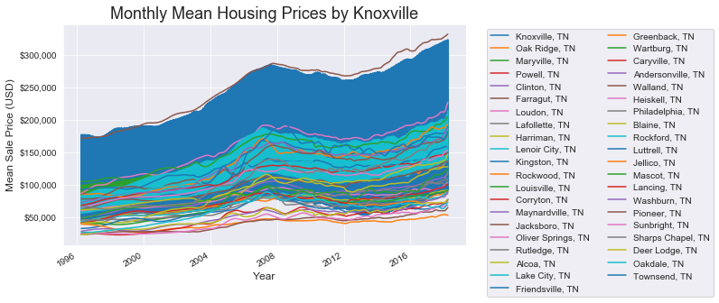

## Return of Investment of Residental Housing Market in the Knoxville Metro Area

### Overview

For the Statistic Modeling Module project of my Flatiron Data Science program, I was giving data from [Zillow](https://www.zillow.com/research/data/) and was tasked with determining the top 5 zip code that would provide the best investment. The method for determining the best investment in was return on investment (ROI) after one year, a ratio of the increase in the value of a property over the initial purchase price.

$$ROI  = (Value_{Final} - Value_{Initial})/ Value_{Initial}$$

### Description of the Data and Location

The examined area is the Knoxville, TN, moderate sized city in eastern Tennessee. The city is the thrid largest in the state behind Memphis and Nashville, and boasts University of Tennessee with it 28,321 enrollment. The Knoxvile Metro Area is the 63th largest in the country and a has experience over 5% population increase since the last census in 2010. 

The Zillow data range from the April 1996 to April 2018 of month median home sales form every zip code in the country.   I also supplimented with additional data from Zillow month sales data as well. Filtering by metro area, I analyze the zip code associated with Knoxville. See a glimpse of that data in the table below.

Area Analysis

There are 57 zip codes in the area with 3 multiple zip code municipalities. Knoxville is the most with 14, and smaller cities in neighboring county make up the other two, Maryville (3), and Lenoir City (2). Maryville, the next largest, is located south of Knoxville and close to the airport and has a small liberal arts college that bares its name. Lenoir City is southwest and has a wide geography area, but it is quite narrow because city expansion along state route TN-321, a main thru fare with many businesses. The rest (38) have only one zip code. 

In 2017, the top ten zip code by number sales (597–997 sales) were spread among four municipalities, Knoxville with seven of the top zip codes and Maryville, Oak Ridge, and Farragut with one each. Knoxville is by far the largest city in the area. Oak Ridge and Farragut are both suburbs west of Knoxville. Farragut is an affluent town in the same county as Knoxville (Knox County). Oak Ridge is farther northwest of Knoxville, and boasts large federal nuclear facilities and national laboratory that provides the major industry for the city and is important for the entire area.

Looking at pricing trends, most the zip codes follow the same general pattern. There is steady growth from the mid 1990's to the 2007–2008 recession where most pricing decreased . A pricing trough developed post 2009 and into the early 2010's followed by a return to steady growth to the present. 

Recession

All the zip codes experienced a drop in median home price ranging from 6.8% to 36.6% with an average of 15.6% . Although there were zip codes that have not recovered from the recession, most zip codes saw an increase from pre-recession highs with the average zip code 15.7% higher post crash. Even the non recovering zip codes are see a uptrend in the last five years.

### Result

<body>I completed to two analysis useing SAMIRAX Time Series Modeling from the Statsmodels python library. One was for all the zip codes and one that filter out the all zip code with less that 200 sales in 2017. </body>

Initial Analysis

Below is the projected sales for the top zip  code with ROI's ranging from 
33.9% to 51.2% annual increase.

After looking at the map of the zip codes and with my knowledge of the area, I noticed that they we are in rural areas. The areas were all on the outskirt in the city centers. As you can see below the select zip code had small numbers of annual sales. 

I decided to look at the areas to with more than 200 sales in 2017 as threshold. This way I could mark out more urban and suburban area for investment.

Over 200 Analysis

Below is the projected sales for the top zip  code with ROI's ranging from 
13.1% to 20.1%.

Zip codes selected were closer to populated areas. The area sales where spread out among the other zip code sales totals.

### Recommendation

The above areas would make good investments. The first analysis showed very high grow with percent increases between 33.9% and  51.2%. Although there should be caution between of the rural nature of the area and low sales volume. The over 200 sales analysis shows a more established areas with impressive, but still good growth between 13.1% and  20.1%.

Additional analysis can be. In particular looking at smaller geographical area than zip code. The division would include but not limited to:
<ul>
    <li>School Zones</li>
    <li>Zoning Maps</li>
    <li>Neighborhood Divisions</li>
</ul>
